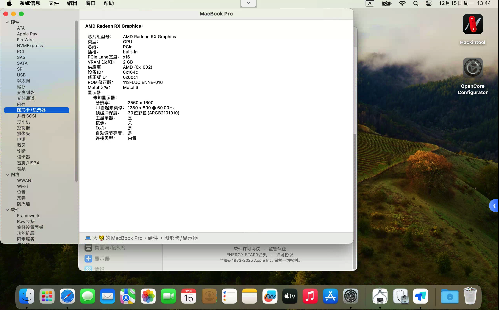

# TIMI RedmiBook Pro 14S 锐龙版 黑苹果 EFI

本项目提供适用于 **TIMI RedmiBook Pro 14S 锐龙版** 的黑苹果 OpenCore EFI 配置方案，支持 macOS Sonoma 14.8.2 系统。该配置已成功实现完整功能，包括：  
✅ 显卡驱动（AMD Radeon RX Graphics）  
✅ 触控板手势支持（Force Touch）  
✅ 摄像头识别与使用  
✅ Wi-Fi & 蓝牙正常工作  
✅ 电池电量显示与续航监测  
✅ 自动调节亮度、屏幕刷新率控制  

> ⚠️ 注意：本配置基于 AMD Ryzen 7 5700U + Vega 核显平台，仅适用于同型号或相似硬件设备。

---

### 1. 下载 EFI 文件
下载地址:https://www.123865.com/ps/HiZ0Vv-GxnNh

## 🖥️ 硬件规格

| 项目 | 规格 |
|------|------|
| 处理器 | AMD Ryzen 7 5700U with Radeon Graphics (八核) |
| 内存 | 16 GB DDR4 3200MHz (三星) |
| 显卡 | AMD Radeon Graphics (集成，2GB VRAM) |
| 主板 | TIMI TM2013 (AMD PCI 标准主机 CPU 桥) |
| 显示器 | NCP006A (14 英寸, 2560×1600) |
| 存储 | KBG40ZNV512G KIOXIA (512GB NVMe SSD) |
| 网卡 | 英特尔 Wi-Fi 6 AX200 160MHz |
| 电池 | SUNWODA R14B02W (健康度 98.93%) |
| 声卡 | 瑞昱 @ AMD High Definition Audio 控制器 |
| 摄像头 | XiaoMi USB 2.0 Webcam |

---

## 🍏 macOS 系统信息

- **系统版本**: macOS Sonoma 14.8.2
- **机型伪装**: MacBook Pro (13-inch, 2020, Four Thunderbolt 3 ports)
- **序列号**: C02C95Y3ML7H
- **启动磁盘**: Mac
- **CPU**: 1.8 GHz AMD Ryzen 7 5700U
- **内存**: 16 GB 3200 MHz DDR4
- **显卡**: AMD Radeon RX Graphics 2 GB

---

## 🔧 显卡与显示器设置

- **显卡型号**: AMD Radeon RX Graphics
- **VRAM**: 2 GB
- **分辨率**: 2560 × 1600
- **刷新率**: 60 Hz
- **Metal 支持**: ✅ 已启用
- **自动调节亮度**: ✅ 支持

---

## 🎥 摄像头支持

- **型号**: XiaoMi USB 2.0 Webcam
- **Vendor ID**: 0x7119
- **Product ID**: 0x11485
- **唯一 ID**: 0x601000001bcf2cdd

> 可在 FaceTime、Zoom、微信等应用中正常使用。

---

## 💡 触控板功能

触控板已完全适配 macOS 手势操作：

- ✅ 单指轻点
- ✅ 双指滚动
- ✅ 三指滑动切换桌面
- ✅ 四指上下翻页
- ✅ 用力点击（Force Click）支持
- ✅ 静默点按可关闭

---

## 🔋 电池管理

- **电池状态**: 已充满电
- **健康度**: 98.93%
- **充电周期**: 正常
- **低电量模式**: 关闭
- **屏幕打开时用量**: 实时统计

---

## 🖼️ 显示器设置

- **分辨率**: 2560 × 1600
- **刷新率**: 60 Hz
- **颜色描述文件**: Unknown Display
- **自动调节亮度**: ✅ 开启
- **夜览模式**: 可用

---

## 🌐 网络与音视频

- **Wi-Fi**: 英特尔 AX200 正常连接
- **蓝牙**: 可配对鼠标、耳机等设备
- **音频输出**: 内置扬声器 & 麦克风可用
- **声音控制**: 系统音量条正常响应

---

## 📁 使用说明

### 1. 下载 EFI 文件
下载地址:https://www.123865.com/ps/HiZ0Vv-GxnNh

## 🛠️ 开发工具推荐

- [OpenCore Configurator](https://github.com/OpenCore-Legacy-Patcher/OpenCore-Configurator) – 配置 EFI 的可视化工具
- [Hackintool](https://github.com/dortania/Hackintool) – 硬件检测与补丁生成
