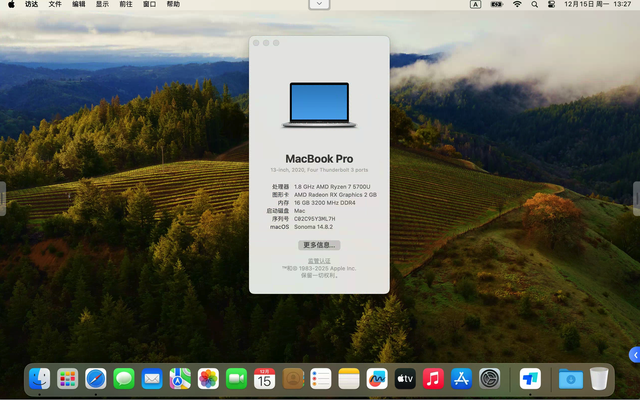
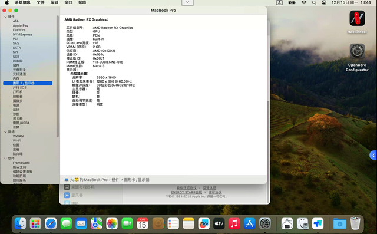
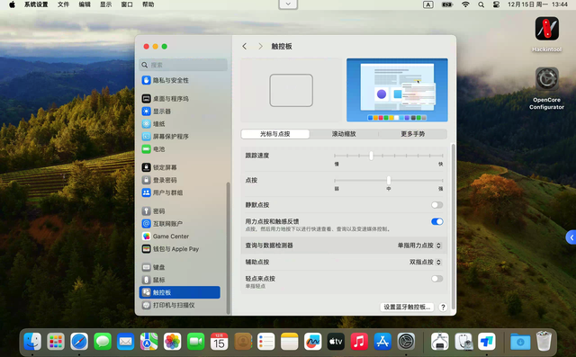
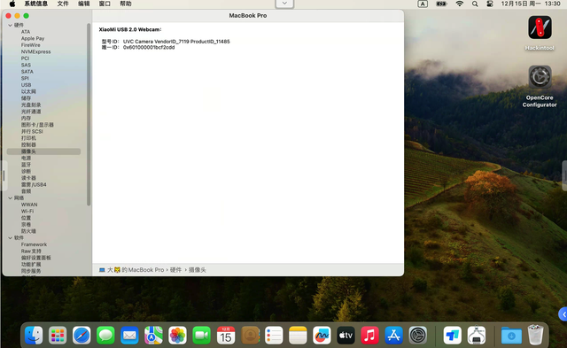
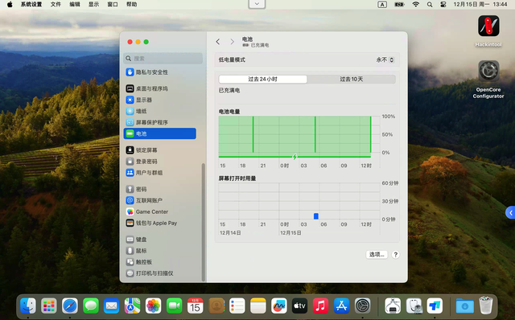
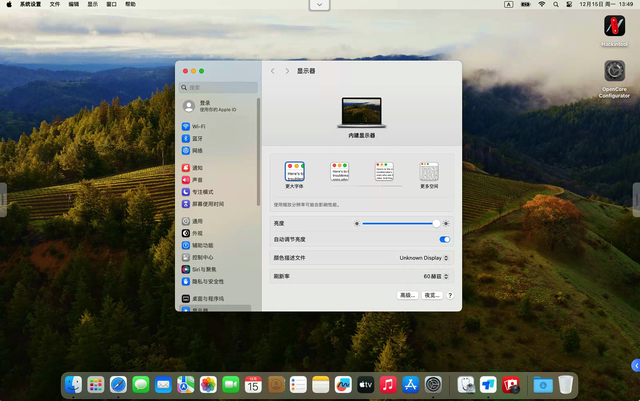
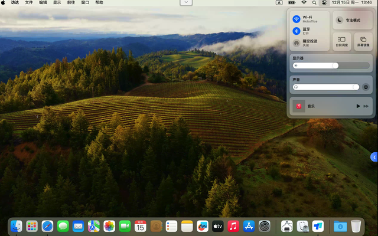
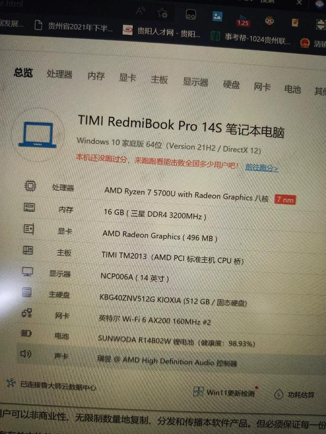

# TIMI RedmiBook Pro 14S 锐龙版 · OpenCore Hackintosh

AMD Ryzen 7 5700U | Vega Graphics | 2560×1600 | macOS Sonoma 14.8.2

---

## Hardware

| Component | Specification |
|:----------|:--------------|
| CPU | AMD Ryzen 7 5700U (8 cores) |
| GPU | AMD Radeon Graphics (2 GB VRAM) |
| RAM | 16 GB DDR4 3200 MHz (Samsung) |
| Motherboard | TIMI TM2013 |
| Display | 14" 2560×1600 (NCP006A) |
| Storage | KIOXIA KBG40ZNV512G (512 GB NVMe) |
| Wi-Fi / Bluetooth | Intel AX200 160 MHz |
| Audio | Realtek @ AMD HD Audio |
| Webcam | XiaoMi USB 2.0 |

## Driver Status

| Feature | Status | Feature | Status |
|:--------|:------:|:--------|:------:|
| Graphics (Metal) | ✅ Working | Battery | ✅ Working |
| Touchpad (Force Touch) | ✅ Working | Audio | ✅ Working |
| Webcam | ✅ Working | Auto Brightness | ✅ Working |
| Wi-Fi | ✅ Working | HiDPI | ✅ Supported |

## macOS System

- **Model**: MacBook Pro (13-inch, 2020)
- **Boot Volume**: Mac
- **Resolution**: 2560 × 1600 @ 60 Hz

---

## Installation

1. Download EFI from [123 Cloud](https://www.123865.com/ps/HiZ0Vv-GxnNh)
2. Create bootable USB using BalenaEtcher
3. Replace EFI on USB EFI partition
4. Boot from USB → OpenCore → Install macOS
5. Copy EFI to system drive after installation

---

## Screenshots

Click thumbnails for full resolution.

| | |
|:---:|:---:|
|  |  |
|  |  |
|  |  |
|  |  |

## Tools

- [OpenCore Configurator](https://github.com/OpenCore-Legacy-Patcher/OpenCore-Configurator)
- [Hackintool](https://github.com/dortania/Hackintool)
- [ProperTree](https://github.com/corpnewt/ProperTree)
